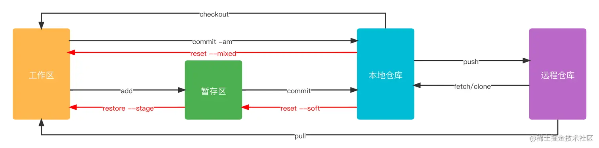

# 常用 git 命令

## git  工作区域

根据 git 的几个文件存储区域，git 的工作区域可以划分为4个：  

- 工作区：编辑器里改动的代码
- 暂存区：通过`git add`指令，会把`工作区`改动的代码提交到`暂存区`里
- 本地仓库：通过`git commit`命令，会把`暂存区`变动的代码提交到`本地仓库`中，`本地仓库`位于`本地电脑`上
- 远程仓库：通过`git push`命令，会把`本地仓库`的代码推送到`远程仓库`中




## 配置 git

### 配置用户信息

```shell
# 配置用户名
git config --global user.name "yourname"

# 配置用户邮箱
git config --global user.email "youremail@xxx.com"

# 查看当前配置信息
git config --global --list

# 通过 alias 配置别名
# 例如使用 git co 代替 git checkout
git config --global alias.co checkout
```


### 配置 ssh key

向`远程仓库`提交代码时，需要在`远程仓库`添加`本地仓库`所在主机本地生成的 `ssh key`

```shell
# 本地生成 ssh key
ssh-keygen -t rsa -C "youremail@xxx.com"

# 查看本地生成的 ssh key
cat ~/.ssh/id_rsa.pub
```


## 高频命令

### git clone: 克隆仓库

```shell
# 克隆远程仓库到本地
git clone <git url>

# 克隆远程仓库到本地，并且同时切换到指定分支 branch1
git clone <git url> -b branch1

# 克隆远程仓库到本地并指定本地仓库的文件夹名称为 my-project
git clone <git url> my-project
```


### git add: 提交到暂存区

将`工作区`发生修改的代码提交到`暂存区`

```shell
# 将 `所有修改的` 文件都提交到暂存区
git add .

# 将修改的文件中的指定文件 a.js 和 b.js 提交到暂存区
git add ./a.js ./b.js

# 将 js 文件夹下修改的内容提交到暂存区
git add ./js/*
# or
git add ./js
```


### git commit: 提交到本地仓库

将`暂存区`发生修改的代码提交到`本地仓库`

```shell
# 将工作区内容提交到本地仓库，并添加提交信息 your commit message
git commit -m "your commit message"

# 将工作区内容提交到本地仓库，并对上一次 commit 记录进行覆盖
# 例如先执行 git commit -m "commit1" 提交了文件a，commit_sha为hash1；再执行 git commit -m "commit2" --amend 提交文件b，commit_sha为hash2。最终显示的是a，b文件的 commit 信息都是 "commit2"，commit_sha都是hash2
git commit -m "new message" --amend

# 将工作区内容提交到本地仓库，并跳过 commit 信息填写
# 例如先执行 git commit -m "commit1" 提交了文件a，commit_sha为hash1；再执行 git commit --amend --no-edit 提交文件b，commit_sha为hash2。最终显示的是a，b文件的 commit 信息都是 "commit1"，commit_sha都是hash1
git commit --amend --no-edit

# 跳过校验直接提交，很多项目配置 git hooks 验证代码是否符合 eslint、husky 等规则，校验不通过无法提交
# 通过 --no-verify 可以跳过校验（为了保证代码质量不建议此操作QwQ）
git commit --no-verify -m "commit message"

# 一次性从工作区提交到本地仓库，相当于 git add . + git commit -m
git commit -am
```


### git push: 提交到远程仓库

`git push` 会将`本地仓库`的的内容提交到`远程仓库`

```shell
# 将当前本地分支 branch1 内容推送到远程分支 origin/branch1
git push [origin branch1]

# 若当前本地分支 branch1 没有对应的远程分支 origin/branch1，需要推送当前分支并建立与远程上游的跟踪
git push --set-upstream origin branch1

# 强制提交
git push -f
```


### git pull: 拉取远程仓库并合并

`git pull` 会拉取`远程仓库`并合并到`本地仓库`，相当于执行`git fetch` + `git merge`

```shell
# 若拉取并合并的远程分支和当前本地分支名称一致
## 例如当前本地分支为 branch1，要拉取并合并 origin/branch1，则直接执行：
git pull

# 若拉取并合并的远程分支和当前本地分支名称不一致
git pull <远程主机名> <分支名>
## 例如当前本地分支为 branch2，要拉取并合并 origin/branch1，则执行：
git pull git@github.com:zh-lx/git-practice.git branch1

# 使用 rebase 模式进行合并
git pull --rebase
```


### git checkout: 切换分支

`git checkout`用来切换分支及撤销`工作区`内容的修改

```shell
# 切换到已有的本地分支 branch1
git checkout branch1

# 切换到远程分支 branch1
git checkout origin/branch1

# 基于当前本地分支创建一个新分支 branch2，并切换至 branch2
git checkout -b branch2

# 基于远程分支 branch1 创建一个新分支 branch2，并切换至 branch2
git checkout origin/branch1 -b branch2
## 当前创建的 branch2 关联的上游分支是 origin/branch1，所以 push 时需要如下命令关联到远程 branch2
git push --set-upstream origin branch2

# 撤销工作区 file 内容的修改。危险操作，谨慎使用
git checkout -- <file>

# 撤销工作区所有内容的修改。危险操作，谨慎使用
git checkout .
```


### git branch: 查看分支

```shell
# 查看本地分支
git branch

# 查看全部分支
git branch -a

# 查看远程分支
git branch -r

# 查看全部分支并且标识当前正在使用的分支
git branch -av

# 查看所有分支（本地和远程）并且标识当前正在使用的分支，并且列出最后一次提交的信息
git branch -avv
```


